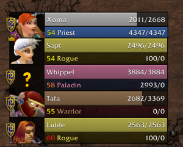
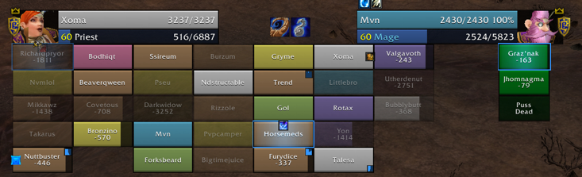

# LunaUnitFrames

A comprehensive and highly customizable unit frames addon for **WoW Classic Anniversary - The Burning Crusade** (Patch 2.5.5).

## Features

### Unit Frames
- **Player, Target, Target of Target** frames with full customization
- **Party frames** with configurable layout
- **Raid frames** optimized for 40-man raids
- **Pet, Focus, and Boss** frames

### Core Features
- **Config mode** for easy visual setup and positioning
- **Healing prediction** via LibHealComm-4.0 integration
- **Native aura durations** (TBC provides duration info natively)
- **Enemy and friendly castbars** using LibClassicCasterino
- **Energy / MP5 ticker** for resource management
- **Druid mana bar** - track mana while shapeshifted
- **Reckoning tracker** for Paladin stacks
- **Totem timer** for Shaman totems
- **Mana cost prediction** on the power bar

### Customization
- Fully configurable bar textures and fonts via LibSharedMedia
- Adjustable frame sizes, positions, and layouts
- Customizable aura filtering and display
- Class-colored health bars
- Portrait options (2D, 3D, class icons)

## Installation

1. Download the latest release
2. Extract to your `World of Warcraft\_anniversary_\Interface\AddOns` folder
3. Ensure the folder is named `LunaUnitFrames`

## Configuration

Type `/luna` or `/luf` in-game to open the configuration panel.

## Recommended Companion Addons

- [Clique](https://www.wowinterface.com/downloads/info5108-Clique.html) - Click-casting support

## Compatibility

- **WoW Classic Anniversary (TBC)** - Interface 20505 (Patch 2.5.5)

This addon is **not** compatible with Retail, Cataclysm Classic, WotLK Classic, or Classic Era
